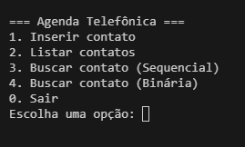
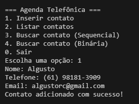
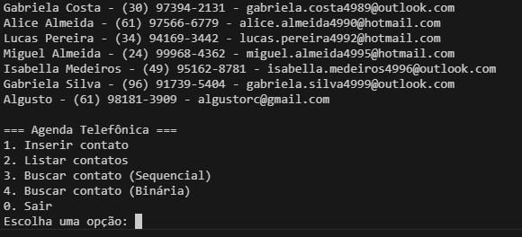

# Busca_AgendaTelefonica

## Alunos

| Matrícula   | Nome                     |
|-------------|---------------------------|
| 202017521   | Algusto Rodrigues Caldas |

---

## Descrição do Projeto

Este projeto implementa uma **Agenda Telefônica** utilizando algoritmos de **busca sequencial** e **busca binária**.  
O objetivo é permitir a pesquisa eficiente de contatos cadastrados (nome, telefone e e-mail), além de demonstrar, na prática, a diferença entre os dois tipos de busca.

Funcionalidades principais:
- Inserir contatos (nome, telefone e e-mail).  
- Listar todos os contatos.  
- Buscar contato por nome utilizando:  
  - **Busca Sequencial**  
  - **Busca Binária** (com a lista previamente ordenada).  

---

## Guia de Instalação

### Dependências do Projeto
- Linguagem: **Python 3.10+** (pode ser facilmente adaptado para C).  
- Nenhuma biblioteca externa é necessária.  

### Como Executar o Projeto
1. Clone o repositório:
   ```bash
   git clone https://github.com/SeuUsuario/Busca_AgendaTelefonica.git
2. Acesse a pasta do projeto:
   ```bash
   cd Busca_AgendaTelefonica
3. Execute o programa:
   ```bash
   python main.py

---

## Capturas de tela
### Apresentação

[Assista ao vídeo no YouTube](https://www.youtube.com/watch?v=FI09LgvLptY)

### Aplicação em execução

#### Tela do Menu


#### Inserção de Contato


#### Lista de Contatos


---

## Conclusões 
- A busca binária se mostrou significativamente mais eficiente que a busca sequencial, especialmente em bases grandes.

- O Projeto permite observar na prática a diferença de tempo entre os algoritmos de busca.